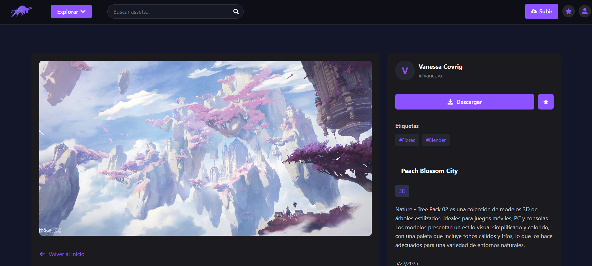

🎮 BULL3D - Plataforma de Gestión de Assets

  
  
  
  

## 📋 Descripción

**BULL3D** es una plataforma web diseñada específicamente para la gestión de assets digitales. Construida con el stack MERN, ofrece una solución para organizar, catalogar y administrar todos los recursos digitales necesarios en el proceso de desarrollo de videojuegos.

## ✨ Características Principales

🎯 **Gestión Centralizada de Assets** - Organiza todos tus recursos 3D, texturas, sonidos y más en un solo lugar

🔐 **Sistema de Autenticación Seguro** - Control de acceso basado en JWT con encriptación bcrypt

📱 **Interfaz Moderna y Responsiva** - Diseñada con Material UI para una experiencia de usuario excepcional

☁️ **Almacenamiento en la Nube** - Integración con Google Cloud.

## 🛠️ Stack Tecnológico

### Frontend
- **React.js** - Biblioteca de JavaScript para interfaces de usuario
- **Context API/Redux** - Gestión de estado global

### Backend
- **Node.js** - Entorno de ejecución de JavaScript
- **Express.js** - Framework web minimalista y flexible
- **JWT** - Autenticación basada en tokens
- **bcrypt** - Hashing de contraseñas

### Base de Datos
- **MongoDB** - Base de datos NoSQL orientada a documentos
- **Mongoose** - ODM elegante para MongoDB y Node.js

## 🚀 Instalación y Configuración

### Prerrequisitos
- Node.js (v14 o superior)
- MongoDB (local o Atlas)
- npm o yarn

### Pasos de Instalación

1. **Clonar el repositorio**
bash
git clone https://github.com/vancovx/BULL3D.git
cd BULL3D

2. **Instalar dependencias del backend**
bash
cd backend
npm install

3. **Instalar dependencias del frontend**
bash
cd ../frontend
npm install

4. **Configurar variables de entorno**
bash
# En el directorio backend, crear .env
NODE_ENV = production
PORT = 5000
MONGO_URI = tu_url_de_mongodb
JWT_SECRET = tu_clave_secreta_jwt
GOOGLE_DRIVE_CREDENTIALS = tus_claves_google_cloud

5. **Iniciar el servidor de desarrollo**
bash
# Terminal 1 - Backend
cd backend
npm run dev

# Terminal 2 - Frontend
cd frontend
npm run dev

## 📂 Estructura del Proyecto

BULL3D/
├── backend/
│   ├── models/          # Modelos de datos (Mongoose)
│   ├── routes/          # Rutas de la API
│   ├── middleware/      # Middlewares personalizados
│   ├── controllers/     # Lógica de controladores
│   └── config/          # Configuraciones
├── frontend/
│   ├── src/
│   │   ├── components/  # Componentes reutilizables
│   │   ├── pages/       # Páginas principales
│   │   ├── context/     # Context API
│   │   ├── services/    # Servicios API
│   │   └── utils/       # Utilidades
│   └── public/          # Assets estáticos
└── README.md

## 👨‍👨‍👧 Equipo de Desarrollo

[**Vanessa Covrig**](https://github.com/vancovx) 

[**Alejandro Villena**](https://github.com/AlexxCFH)

[**Antonio Morales**](https://github.com/Anmorales0)

---

  
⭐ Si te gusta este proyecto, ¡no olvides darle una estrella! ⭐

